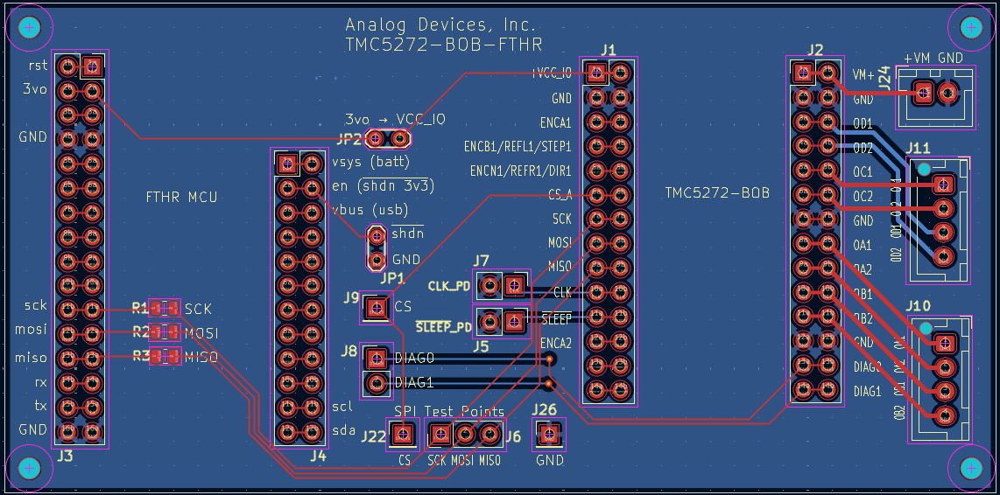
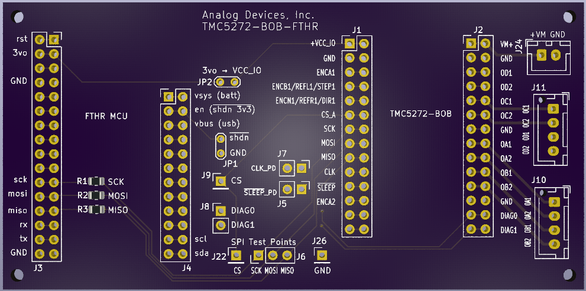

# TMC5272-BOB-FTHR

An adapter board for connecting Adafruit Feather-format MCU boards to the TMC5272 breakout board (BOB) for prototyping applications.

**Trinamic / Analog Devices, Inc.**

## Overview

This adapter board provides a simple platform for connecting any Adafruit Feather (FTHR) form factor microcontroller to a TMC5272-BOB. The board breaks out connections including SPI, power, and control signals to facilitate rapid prototyping and evaluation of the TMC5272 stepper motor driver.

This project was designed with KiCad 10.

## Features

- Compatible with Adafruit Feather form factor MCU boards.
- Dual-row headers: Inner column accepts female headers for board insertion, outer column (optional) for male pins to probe signals or attach jumper wires.
- Flexible signal routing: CS, DIAG0, and DIAG1 are jumper-configurable to connect to any desired MCU pin.
- Test points for easy debugging.

## Board Layout

## Fabrication

Gerber files are available in the `gerber/` directory. The ZIP file in that folder can be uploaded directly to [OSH Park](https://oshpark.com/) for fabrication.
